### Probability Practice - Part A

    #P(RC) = 0.3
    #P(TC) = 0.7
    #P(Yes | RC) = 0.5
    #P(No | RC) = 0.5
    #P(Yes) = 0.65
    #P(No) = 0.35
    #P(Yes) = P(Yes | RC) * P(RC) + P(Yes | TC) * P(TC)
    #0.65 = 0.5 * 0.3 + P(Yes | TC) * 0.7
    (0.65 - (0.5*0.3))/0.7

    ## [1] 0.7142857

    #P(Yes | TC) = 0.7143

### Probability Practice - Part B

    #P(Pos | HIV+) = 0.993
    #P(Neg | HIV+) = 0.007
    #P(Neg | HIV-) = 0.9999
    #P(Pos | HIV-) = 0.0001
    #P(HIV+) = 0.000025
    #P(HIV-) = 0.999975
    #P(Pos) = P(Pos | HIV+) * P(HIV+) + P(Pos | HIV-) * P(HIV-)
    0.993*0.000025 + 0.0001*.999975

    ## [1] 0.0001248225

    #P(Pos) = 0.0001248225
    #P(HIV+ | Pos) = (P(Pos|HIV+)*P(HIV+))/(P(Pos))
    (0.993*0.000025)/0.0001248225

    ## [1] 0.1988824

    #P(HIV+ | Pos) = 0.1988824

Many people would end up thinking that they have HIV because they tested
positive for it.

### Green Buildings

    library(knitr)
    library(mosaic)
    library(readr)
    green = read.csv("C:/Users/jevan/Downloads/greenbuildings.csv")
    clean_green = green[green$leasing_rate > 10 & green$age > 1,]
    clean_green$total_rent = clean_green$Rent * clean_green$size
    clean_green$log_rent = log(clean_green$total_rent)

I made a clean green dataframe that only contains buildings that have a
leasing rate higher than 10% AND are older than 1 year. I added the 1
year criteria in because a younger building may not have many occupants
yet. I also added a column called total rent taht multiplies the rent
per square foot by the square footage of the buildings in the dataframe.
This will be useful later. Additionally, I took the log of the total
rent so I could have a much more manageable number to work with for
rent.

    green_scaled = scale(clean_green, center=TRUE, scale=TRUE) 
    # Form a pairwise distance matrix using the dist function
    green_distance_matrix = dist(green_scaled, method='euclidean')
    non_green = clean_green[clean_green$green_rating==0,]
    non_green_scaled = scale(non_green, center=TRUE, scale=TRUE)
    green_green = clean_green[clean_green$green_rating==1,]
    green_green_scaled = scale(green_green, center=TRUE, scale=TRUE)
    ##Boxplots
    boxplot(non_green$size, green_green$size, use.cols=TRUE, col=rainbow(3), main='Non-Green vs. Green Sizes',
       ylab="Size")

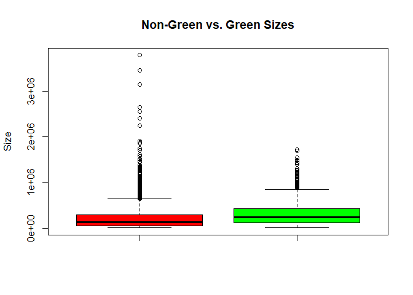

    boxplot(non_green$age, green_green$age, use.cols=TRUE, col=rainbow(3), title='Non-Green vs. Green Age',main='Non-Green vs. Green Ages',
       ylab="Age")

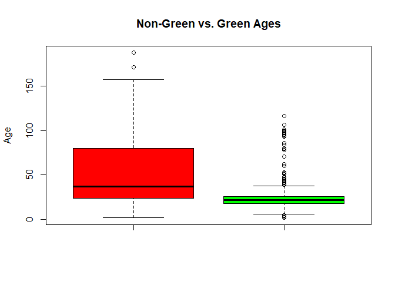

    boxplot(non_green$leasing_rate, green_green$leasing_rate, use.cols=TRUE, col=rainbow(3),main='Non-Green vs. Green Leasing Rates', ylab="Leasing Rate")

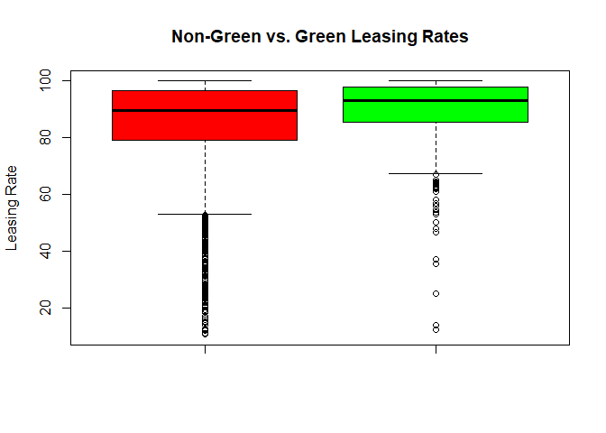

    boxplot(non_green$log_rent, green_green$log_rent, use.cols=TRUE, col=rainbow(3), range = 3000,main='Non-Green vs. Green Log Rents',ylab="Log Rent")

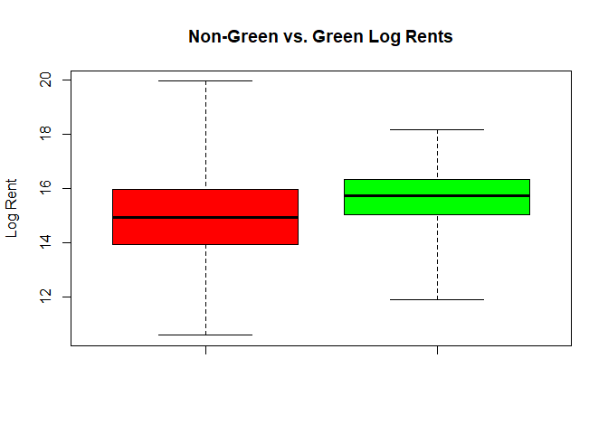
The boxplots show us that on average, green buildings are newer than
non-green buldings, they are slightly larger in size, they have higher
leasing rates, and they have slightly higher rents.

    sp1 = qplot(stories, log_rent, color = green_rating, data = clean_green)
    sp1 = sp1+scale_color_gradient(low="indianred1", high="green")
    sp1 = sp1 + geom_vline(xintercept=10, color='black',size=1)
    sp1 = sp1 + geom_vline(xintercept=20, color='black',size=1)
    sp1

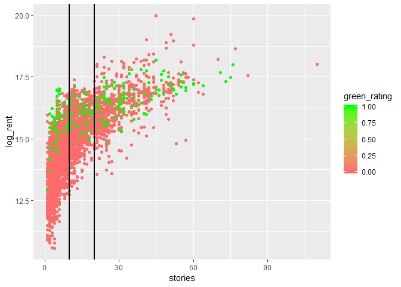

    green_green20 = green_green[green_green$stories < 20 & green_green$stories > 10,]
    non_green20 = non_green[non_green$stories < 20 & non_green$stories > 10,]

    boot1 = do(2500)*{
    median(resample(non_green20)$total_rent,size = 30)
    }

    confint(boot1, level=.99)

    ## Warning: package 'bindrcpp' was built under R version 3.4.4

    ##     name   lower   upper level     method estimate
    ## 1 result 4476662 5125618  0.99 percentile  4942860

    boot2 = do(2500)*{
    median(resample(green_green20)$total_rent,size = 30)
    }
    par(mfrow=c(1,2))
    hist(boot2$result, 30, col='green', main ='Green Median Rent')
    hist(boot1$result, 30, col='indianred1', main ='Non-Green Median Rent')

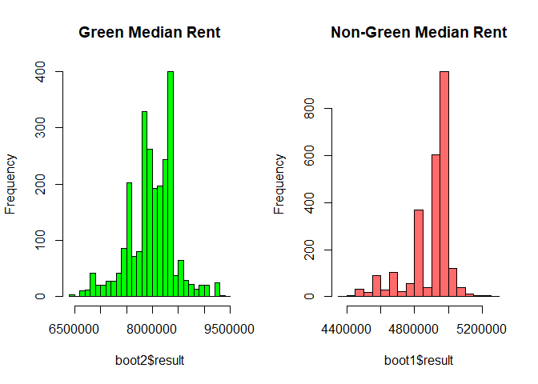

    confint(boot1, level=.99)

    ##     name   lower   upper level     method estimate
    ## 1 result 4476662 5125618  0.99 percentile  4942860

    confint(boot2, level=.99)

    ##     name   lower   upper level     method estimate
    ## 1 result 6668261 9216000  0.99 percentile  7993447

Since we are planning on building a 15 story green building, I wanted to
see how the rent is associated with the number of stories for green
buldings and non-green buldings. Not surprisingly, these two variables
are positively correlated for both types of buildings. However, the
rents for non-green buildings tend to be lower than the rents for green
buildings. I added in two black bars at the 10 and 20 story mark because
I wanted to focus on the buildings that were in this range. I think that
these buildings would give the best estimate of the rent of a 15 story
green building.

I then used bootstrapping to see just how much larger the median total
rent for green buildings was compared to the median rent of non-green
buildings. The numbers were astonishing. The rent was much higher for
green homes in this range. For this reason, I would recommend going
ahead with the project.

### Bootstrapping

    library(mosaic)
    library(quantmod)
    library(foreach)

    set.seed(8)
    # Import a few stocks
    mystocks = c("LQD", "TLT", "SPY", "EEM", "VNQ")
    getSymbols(mystocks)

    # Adjust for splits and dividends
    LQDa = adjustOHLC(LQD)
    TLTa = adjustOHLC(TLT)
    SPYa = adjustOHLC(SPY)
    EEMa = adjustOHLC(EEM)
    VNQa = adjustOHLC(VNQ)

    all_returns = cbind(    ClCl(LQDa),
                         ClCl(TLTa),
                         ClCl(SPYa),
                         ClCl(EEMa),
                         ClCl(VNQa))
    head(all_returns)
    all_returns = as.matrix(na.omit(all_returns))

    plot(ClCl(LQDa),col='darkgreen')

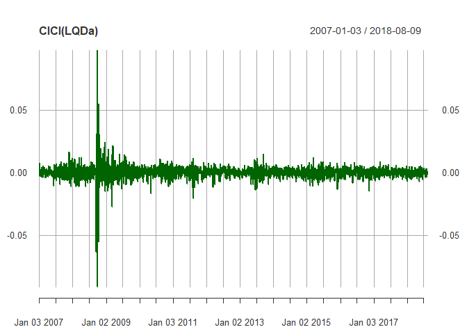
This seems like the safest ETF. It fluctuated in 2008 (like most other
ETFs), but it has been rather consistent since that time.

    plot(ClCl(TLTa),col='indianred1')

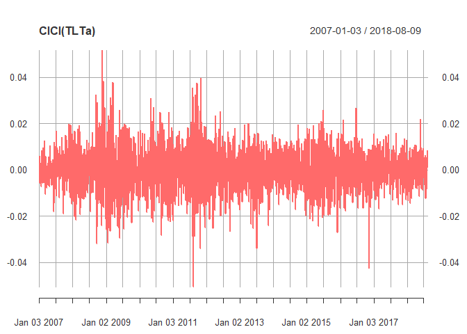
This ETF fluctuates significantly, but its values are so low that the
fluctuations aren't very meaningful.

    plot(ClCl(SPYa), col='indianred')

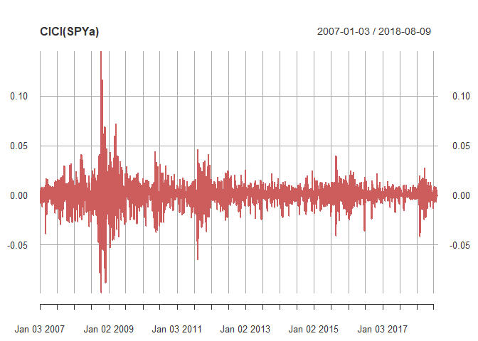
This ETF has significantly fluctuated a few times in the past, and its
values are higher than the two previous ETFs, so it seems like it comes
with some risk.

    plot(ClCl(EEMa), col='red')

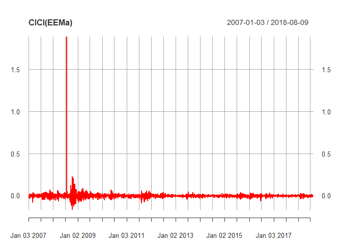
This ETF had a very significant fluctuation in 2008, and its values are
higher than any of the other ETFs, so it has a relatively large amount
of risk.

    plot(ClCl(VNQa),col='darkred')

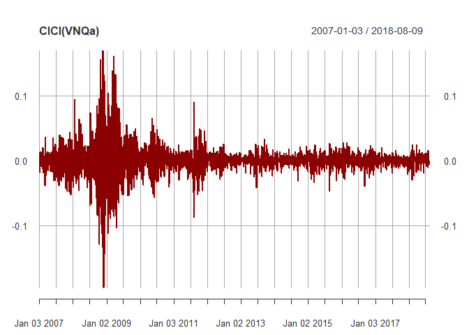
This ETF seems a little riskier than SPY because it can dip pretty low
during bad times, but it is also worth noting that it has been mostly
consistent since 2008.

##### Safe Choice

    initial_wealth = 100000
    sim2 = foreach(i=1:5000, .combine='rbind') %do% {
      total_wealth = initial_wealth
      weights = c(0.6, 0.1, 0.1, 0.1, 0.1)
      holdings = weights * total_wealth
      n_days = 20
      wealthtracker2 = rep(0, n_days)
      for(today in 1:n_days) {
        weights = c(0.6, 0.1, 0.1, 0.1, 0.1)
        return.today = resample(all_returns, 1, orig.ids=FALSE)
        holdings = total_wealth * weights
        holdings = holdings + holdings*return.today
        total_wealth = sum(holdings)
        wealthtracker2[today] = total_wealth
      }
      wealthtracker2
    }

    plot(wealthtracker2, type='l', col='darkgreen',lwd=3)

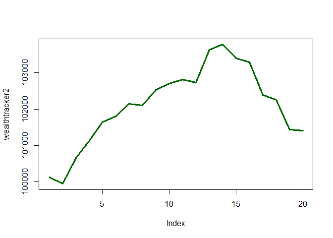

    # Profit/loss
    mean(sim2[,n_days])

    ## [1] 100680.3

    hist(sim2[,n_days]- initial_wealth, breaks=30,col='darkgreen')

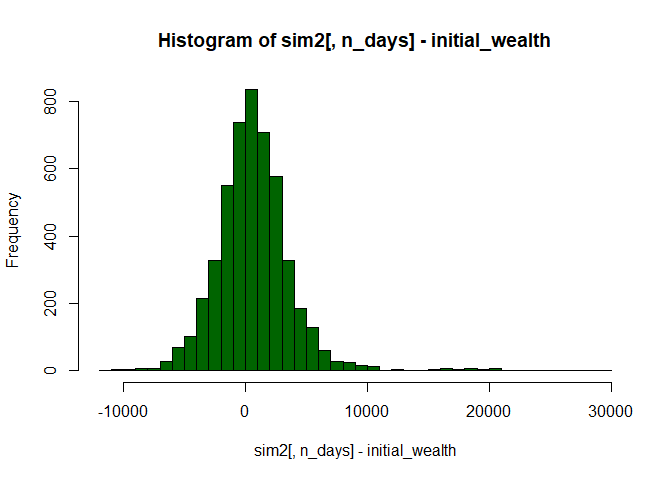

    # Calculate 5% value at risk
    quantile(sim2[,n_days], 0.05) - initial_wealth

    ##        5% 
    ## -3844.786

I put the majority of the weight into the LQD ETF because it seemed the
safest. It has been pretty consistent over the years and it usually
isn't negative. This option worked well for me. My wealth almost always
increased, and my 5% value at risk is low. This seems like a great
option for investors that are more risk-averse.

##### Equal Weights Option

    initial_wealth = 100000
    sim1 = foreach(i=1:5000, .combine='rbind') %do% {
      total_wealth = initial_wealth
      weights = c(0.2, 0.2, 0.2, 0.2, 0.2)
      holdings = weights * total_wealth
      n_days = 20
      wealthtracker = rep(0, n_days)
      for(today in 1:n_days) {
        weights = c(0.2, 0.2, 0.2, 0.2, 0.2)
        return.today = resample(all_returns, 1, orig.ids=FALSE)
        holdings = total_wealth * weights
        holdings = holdings + holdings*return.today
        total_wealth = sum(holdings)
        wealthtracker[today] = total_wealth
      }
      wealthtracker
    }

    plot(wealthtracker, type='l',col='indianred1',lwd=3)

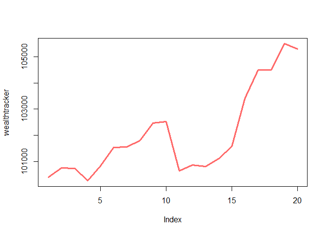

    # Profit/loss
    mean(sim1[,n_days])

    ## [1] 100808.7

    hist(sim1[,n_days]- initial_wealth, breaks=30, col='indianred1')

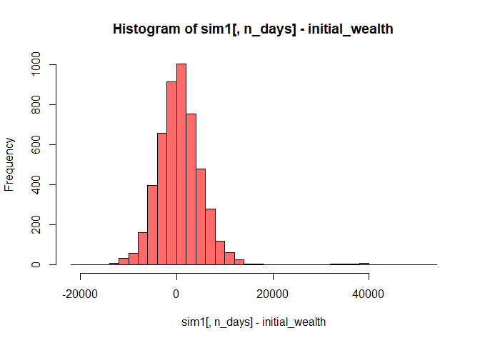

    # Calculate 5% value at risk
    quantile(sim1[,n_days], 0.05) - initial_wealth

    ##       5% 
    ## -6119.76

This doesn't seem like a bad option, but it does carry some risk.
However, the mean returns are greater than the returns for the safe
option. Unfortunately, this also means that you are more likely to lose
money. This is a good option for investors are willing to take a risk,
but aren't prepared to lose more than 2/3 of their investment.

##### Aggressive Option

    initial_wealth = 100000
    sim3 = foreach(i=1:5000, .combine='rbind') %do% {
      total_wealth = initial_wealth
      weights = c(0.0, 0.0, 0.4, 0.4, 0.2)
      holdings = weights * total_wealth
      n_days = 20
      wealthtracker3 = rep(0, n_days)
      for(today in 1:n_days) {
        weights = c(0.0, 0.0, 0.25, 0.5, 0.25)
        return.today = resample(all_returns, 1, orig.ids=FALSE)
        holdings = total_wealth * weights
        holdings = holdings + holdings*return.today
        total_wealth = sum(holdings)
        wealthtracker3[today] = total_wealth
      }
      wealthtracker3
    }

    plot(wealthtracker3, type='l',lwd=3,col='red')

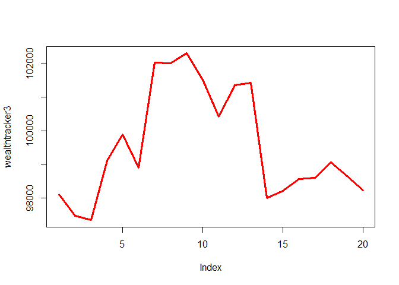

    # Profit/loss
    mean(sim3[,n_days])

    ## [1] 101169.8

    hist(sim3[,n_days]- initial_wealth, breaks=30,col='red')

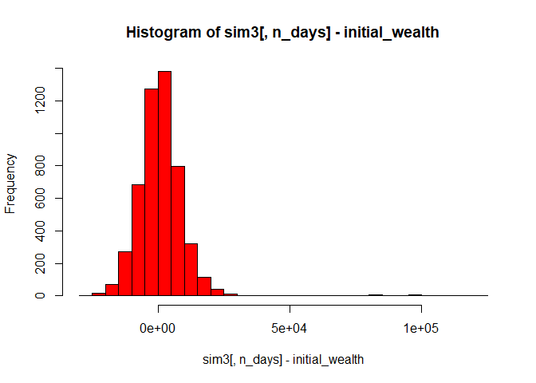

    # Calculate 5% value at risk
    quantile(sim3[,n_days], 0.05) - initial_wealth

    ##        5% 
    ## -11188.65

This option is only for investors that can handle losing their money. If
an investor chooses this option they will most likely lose money, but if
they are lucky, they will make a good amount of money. I put half of the
weight on the EEM ETF because it seemed like it was the most volatile
based on how much it fluctuated in 2008. I put the 25% of the money into
the SPY and VNQ ETFs because they seemed like they had high highs. This
also means that they have low lows as well. I played around with it a
few times and I was able to raise the wealth to $12000 using this
portfolio, so it has the potential to be great, but it is often very
disappointing.

### Market Segmentation

    social_marketing = read.csv("C:/Users/jevan/Downloads/social_marketing.csv", header=TRUE)
    library(corrplot)

    predictors = social_marketing[,-1]
    corrplot(cor(predictors))

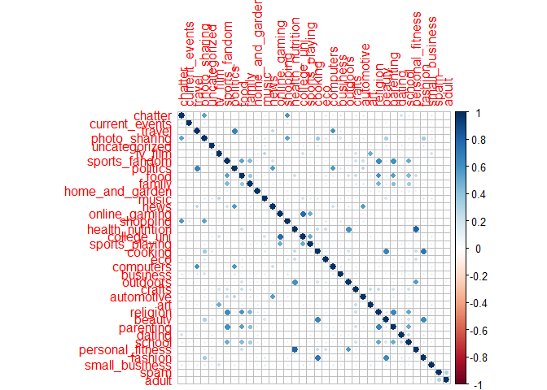
Since the company is called Vitamin Wa-, Nutrient H20, I think that it
is safe to assume that they are trying to focus on the fitness market. A
corrplot allows us to see which features are correlated with fitness
features (personal\_fitness and health\_nutrition) in the dataset. The
corrplot shows us that health\_nutrition and personal\_fitness are
strongly correlated. It also shows that outdoors, cooking, food, and eco
are correlated with health\_nutrition and personal\_fitness. Based on
the findings from the corrplot, Nutrient H20 should focus their
marketing on Twitter users that are interested in these features. For
example, maybe they could partner with outdoor stores like Academy and
REI for a Twitter campaign. Nutrient H20 could use these campaigns to
emphasize how healthy their nutrient-rich drinks are.

    social_marketing$fitYN = ifelse(social_marketing$personal_fitness > 5, 1, 0)

    W = social_marketing[,c('outdoors','personal_fitness','health_nutrition','cooking','eco','food')]

    # Standardize (center/scale) the data
    W_std = scale(W)
    plot(W_std, pch=20, col='orangered')

    pc1 = prcomp(W_std)
    v_best = pc1$rotation[,1]
    slope_best = v_best[2]/v_best[1]  # intercept = 0, slope = rise/run

    par(mfrow=c(1,2))
    plot(W_std,col='orangered',pch=20) 
    abline(0, slope_best)  # plot the subspace as a line

    alpha_best = W_std %*% v_best  
    z_hat = alpha_best %*% v_best  # locations in R^2
    points(z_hat, col='dodgerblue', pch=4)
    segments(0, 0, v_best[1], v_best[2], col='red', lwd=4)

    hist(alpha_best, 25, xlim=c(-3,3), col=rainbow(20), main=round(var(alpha_best), 2))

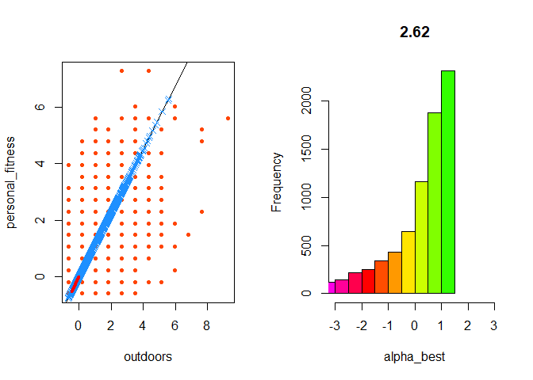

    # Shorthand for this
    var_bycomponent = apply(W_std, 2, var)

    # Compare with the answer from prcomp's plot method
    par(mfrow=c(1,1))
    plot(pc1,col=rainbow(20))

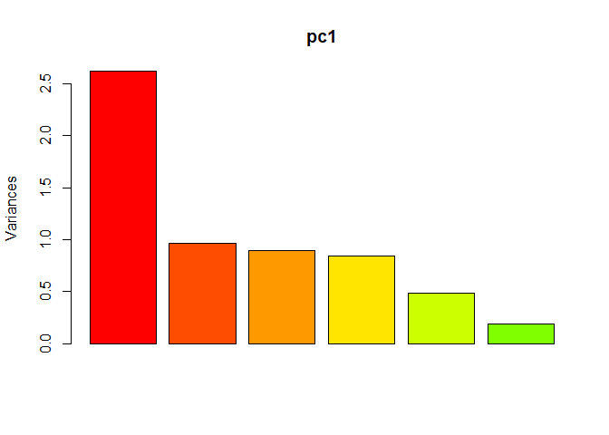

    pc1$sdev^2  # the standard deviation, rather than the variance

    ## [1] 2.6220537 0.9695295 0.8978910 0.8417508 0.4809553 0.1878198

    v_best2 = pc1$rotation[,2]

    pairs(W, col='dodgerblue')

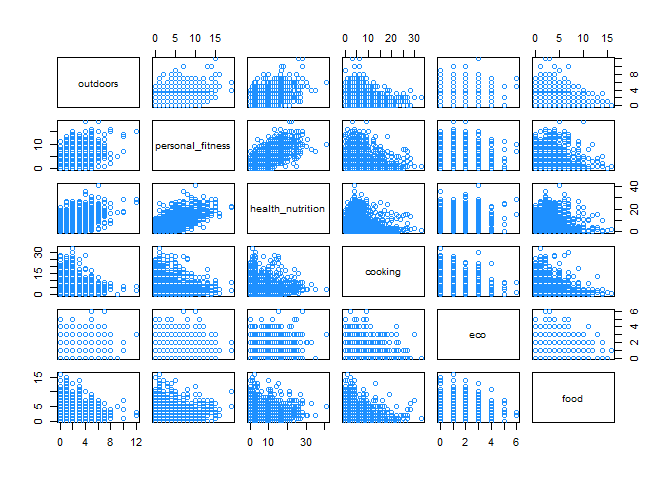

    # Run PCA on all four dimensions
    # scaling inside the prcomp function now
    pc1 = prcomp(W, scale.=TRUE)

    # Look at the basic plotting and summary methods
    summary(pc1)

    ## Importance of components%s:
    ##                          PC1    PC2    PC3    PC4     PC5    PC6
    ## Standard deviation     1.619 0.9846 0.9476 0.9175 0.69351 0.4334
    ## Proportion of Variance 0.437 0.1616 0.1497 0.1403 0.08016 0.0313
    ## Cumulative Proportion  0.437 0.5986 0.7482 0.8885 0.96870 1.0000

    loadings = pc1$rotation
    scores = pc1$x
    sp2 = qplot(scores[,1], scores[,2], color= social_marketing$fitYN, xlab='Component 1', ylab='Component 2')
    sp2 = sp2+scale_color_gradient(low="indianred1", high="dodgerblue")
    sp2

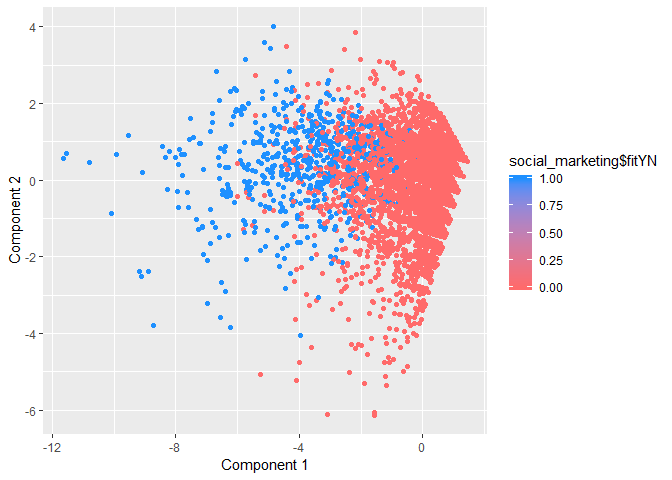

The plots and variances above shed some light on the relationship
between the features we selected from the corrplot. Principal Component
1 makes up a large amount of the variance in the data. We can also see
that we were able to make good use of our feature space. I also created
a column in the dataframe called fitYN that separated Twitter users that
I considered to be fit from Twitter users that were not fit. If someone
rated fitness less than 5, I put them in the non-fit category. If they
rated fitness higher than 5, I said that they were fit. This separation
was solely based on intuition, but it produced some interesting
findings. When we look at the component plot, we see that fit Twitter
(blue dots) users are clearly distinguished from non-fit Twitter users
(red dots). Non-fit Twitter users tend to be more on the right side of
the plot and fit Twitter users are on the left.
